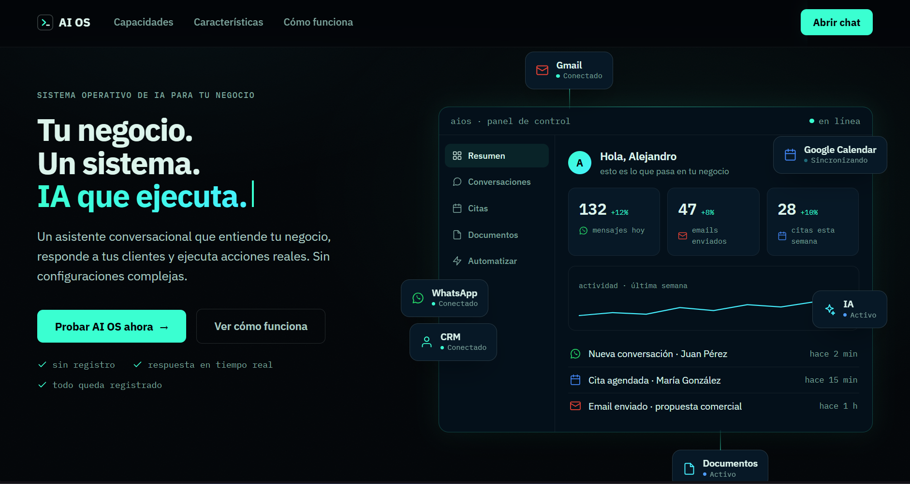

# AI OS

An AI-powered operating system for businesses.


AI OS is a conversational platform that understands user requests, keeps
conversational context, and is designed to execute real business actions
through external integrations (customer support, scheduling, CRM assistance,
email generation). Currently an MVP focused on the core chat experience.

<!-- Add a screenshot or demo GIF here:  -->


## Features

- Real-time chat backed by Convex reactive queries
- AI responses generated by Claude through a Convex action
- Per-customer conversation history persisted in the Convex database
- Marketing landing page with a live product preview
- Strict TypeScript across frontend and backend

## Tech Stack

- **Frontend:** React 19, TypeScript, Vite
- **Backend:** Convex (queries, mutations, actions, scheduler)
- **AI:** Anthropic Claude API (`@anthropic-ai/sdk`)

## Installation

1. Clone the repository:

   ```bash
   git clone https://github.com/juan888420/ai-os.git
   cd ai-os
   ```

2. Install dependencies:

   ```bash
   npm install
   ```

3. Start the Convex dev deployment (creates `.env.local` with your deployment URL):

   ```bash
   npx convex dev
   ```

4. In another terminal, start the frontend:

   ```bash
   npm run dev
   ```

## Environment Variables

| Variable            | Where                  | Description                          |
| ------------------- | ---------------------- | ------------------------------------ |
| `VITE_CONVEX_URL`   | `.env.local`           | URL of your Convex deployment        |
| `ANTHROPIC_API_KEY` | Convex dashboard (env) | API key used by the Claude action    |

Set `ANTHROPIC_API_KEY` in the Convex dashboard under Settings > Environment
Variables. Never commit API keys.

## Usage

Open the app in the browser (default `http://localhost:5173`), enter the chat
and send a message. The message is stored through a Convex mutation, a
scheduled action calls Claude, and the response is persisted and streamed
back to the UI reactively.

## Project Structure

```
ai-os/
├── convex/           # Backend: schema, messages, Claude action
├── src/
│   ├── components/   # Chat UI and landing page
│   └── convexClient.ts
├── Docs/             # Architecture, decisions, roadmap, audit, prompts
└── CLAUDE.md         # Development rules
```

## License

This project is licensed under the MIT License. See [LICENSE](LICENSE) for details.
